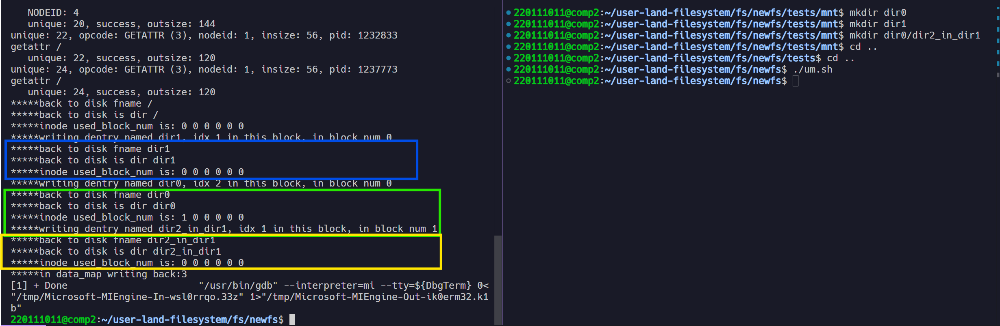

## 自动测试
chmod +x test.sh && ./test.sh

## 在`/`下创建两个目录文件和一个普通文件
因为采用的是头插法，所以遍历dentry的顺序与创建顺序是相反的

## 递归文件的dentry的写回
- 蓝色部分：sync函数参数是dir1的inode，此时开始遍历dir1下的文件。虽然`used_block_num`全为0，但并不会写回。因为dir1的inode.dentrys为空。（dir1下没有任何文件），所以遍历dir1时候并不会往数据块0中写入数据（都不能进入内层的while循环）。
- 绿色部分：sync函数参数是dir0的inode，此时开始遍历dir0下的文件。`used_block_num`为1，0，0，0，0，0。因为dir0下只有一个目录文件，所以dir0的inode指向的数据块中只需要用到第一块数据块。将该dentry写回后，由于`dentry_cursor = dentry_cursor->brother;`，**指向dir2_in_dir1的inode的dentry**没有兄弟dnetry了，所以dentry_cursor在此变成空，循环终止。
- 黄色部分：sync函数的参数是dir2_in_dir1的inode。

> 总结：写回时对于一个目录文件indoe，不是将`used_block_num`六个数据块全部写入到对应的数据块中（要不然0号数据块反复被覆盖），而是通过`dentry_cursor`来遍历由`inode.denrtys`和`dentry.brother`组成的一个链表（该链表即inode指向的数据块中需要存储的dentry数据结构）。通过是否遍历到链表尾部来控制写回dentry是否结束。

